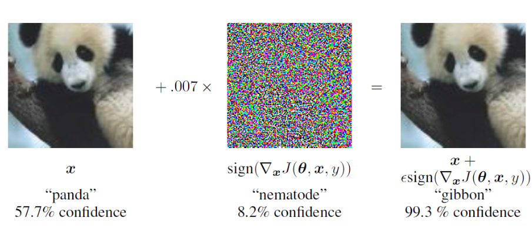
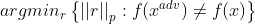

# Adversarial Attack

* ### 등장 배경

  * 2014년 [Intriguing properties of neural networks](https://arxiv.org/pdf/1312.6199.pdf) 에서 입력 이미지의 작은 변화로 심층 신경망을 속일 수 있다는 결과가 발표됨.

  * 이는 DNN이 인간의 신경망을 모방하고, 유사한 방식으로 이미지를 해석한다는 통념을 깼으며, 신경망의 신뢰성에 대한 문제를 재고함.

    

* ### Adversarial Example

  * Original Data에 **육안으로 구분할 수 없는** 작은 noise를 주어 새로운 데이터를 생성함. 이렇게 신경망을 속일 목적으로 만들어진 Data를 Adversarial Example이라고 하며 이때의 noise를 Perturbation(섭동)이라고 함.

    

  * 반면에 전체적으로 noise를 주는 방법 대신, 특정 영역에 초점을 맞추고, 신경망의 주의를 분산시키는 **Patch**를 사용하는 방법도 있음.

    

    

* ### 섭동 측정

  * 적대적 섭동은 양성 이미지와 적대적 이미지의 거리를 측정하는 방법으로 생성함. input space 상에서 섭동이 적용된 이미지가 적대적 기준을 충족하는지 확인하며 이 값의 변경을 최소화.

  * 이 값(노름)을 측정할 때, 대상이 되는 space가 고차원이기 때문에 유클리드 거리는 적합하지 않음. 따라서 전체 픽셀의 차이를 계산하는 L0-norm이나, 모든 픽셀의 변화량이 임계값을 초과했는지 측정하는 L∞-norm을 사용.

  * 다음과 같은 수식으로 표현할 수 있음.

    

    
  
  * 적대적 input data x^(adv)의 output인 f(x^(adv))와 original input data 의 output인 f(x)는 결과가 달라야 하며, 이때 r은 적대적 입력을 생성할 때 더해지는 섭동. 따라서 출력 결과를 다르게 만드는 r의 최소값을 찾는것이 수식의 목표
  
    
  
* ### 생성 방법

  * 공격자가 모델에 접근할 수 있는 수준에 따라 분류

    1. 화이트 박스 :  모델에 대한 완전한 정보가 있음

    2. 제한된 블랙박스 :  모델에 대한 정보나 시스템이 생성한 출력(argumax class)에 대한 정보가 있음

    3. 점수 기반 블랙박스 : 모델이 생성한 모든 출력  점수(softmax score)에 대한 정보가 있음. 화이트 박스와 제한된 블랙박스의 절충

       

  * #### 화이트 박스

    * Image(input space의 vector)를 현재 class의 boundary 밖이나 다른 class의 boundary로 input vector를 이동시켜야 함

    * 이때 brute force 방법은 연산량이 기하급수적으로 커지기 때문에 현실적으로 불가능

    * 화이트 박스 방법은 공격자가 DNN의 알고리즘에 접근할 수 있기 때문에 이를 활용함. 이때 DNN의 gradient를 활용하는데 일반적으로 gradient의 반대방향으로 이동하며 loss minima를 찾지만, adversarial example은 gradient의 정방향으로 이동하며 loss를 maximize하도록 설계됨

      

      

  * #### 제한된 블랙박스

    * original data에 적대적 대상 클래스의 이미지를 희석시키는 방법으로 섭동을 입력함

    * 적대적 클래스의 이미지를 더 많이 희석할수록 data가 class boundary를 넘어갈 확률이 높아지는데, 이때 boundary를 넘지 않고 경계를 따라 점차 적대적 class의 분류 영역쪽으로 이동하게 됨

    * 결과적으로 적대적 class와 유사한 외형을 띄지만 original class의 label을 가진 adversarial example이 만들어짐. 이를 **경계 공격**이라 함

      

      ​	

  * #### 점수 기반 블랙박스 방법

    * 예측 점수로 모델의 알고리즘을 근사하고 적대적 공격을 달성하는데 필요한 섭동을 설정

    * 모델의 알고리즘에 직접 접근할 수 없기 때문에 그라디언트를 계산할수는 없고, 유전 알고리즘등의 간접적인 방법을 사용

      

* ### 견고성 평가

  * 적대적 공격은 세가지 요건으로 정의할 수 있음

    1. 특이성 : 공격이 단순히 DNN으로부터 거짓 예측을 하는것인지, 아니면 특정한 클래스로 거짓 예측을 유도하는지에 대한 여부. 목표에 따라 DNN 입력의 해석 여부가 결정됨
    2. 성공률 : 공격이 분류기를 속여 목표를 달성할 확률.(공격자의 확신)
    3. 섭동 한계(지각력) : 수용 가능한 최대 섭동. 공격 동기와 맥락에 따라 달라지는데, 적대적 패치는 공격자와 방어자 모두 알 수 있기 때문에 숨길 필요가 없지만, 섭동이나 오디오 공격은 방어자가 알 수 없게 숨겨야 한다.

  * 위 세 요소의 상관관계에 따라 견고성 지표를 설정

  * 연구 결과, 입력 공간 내에서 각 클래스의 데이터 포인트 중심부터 최소 섭동 거리만큼의 범위는 섭동으로부터 안전한 안전 구역임이 밝혀짐

    

* ### 방어

  * 세 가지 관점으로 방어를 설명할 수 있음

    1. 모델 개선 : 강력한 신경망을 만들기 위해 모델 자체와 기술에 초점을 맞춤

    2. 입력에서 적대적 측면 제거 : 적대적 입력이 모델에 들어가기 전에 처리

    3. 적대적 정보 최소화 : 적대적 입력을 만들기 어렵도록, 모델과 처리 프로세스를 은닉화

       

  * #### 모델 개선

    * 그래디언트 마스킹 : 공격자가 모델의 그래디언트를 알 수 없도록 함. 알고리즘을 숨기거나, 지식 증류를 통해 loss landscape를 flat하게 만듦

    * 적대적 훈련 : 적대적 사례를 훈련 데이터에 포함시켜서 훈련하여, 입력 공간 내 적대적 하위공간을 class boundary에 편입시킴. 그러나 이외의 데이터에 대해선 여전히 취약함

    * 무작위 드롭아웃 : Dropout은 모델의 불확실성을 확대하고 generalization을 보장함. 적대적 공격에 robustness를 가질 수 있음

      

  * #### 데이터 전처리

    * 정규화, 압축 : 데이터의 포맷 변환, 사이즈 조정 등의 정규화는 데이터에 포함시킨 정보를 줄이고 정밀도를 낮추기 때문에 적대적 정보를 줄이거나 없앨 수 있음

    * 노이즈, 외부 데이터 제거 : 가우시안 블러, 디노이즈 AE 등의 방법은 데이터에 포함된 노이즈(섭동)을 줄일 수 있음

      

  * #### 적대적 정보 최소화

    * 쿼리 패턴 탐지 : 이미지 해싱을 통해 유사한 이미지를 반복적으로 사용해 공격하는 사용자를 탐지
    * 피드백 최소화 : 쿼리에 반환되는 정보를 최소화하여 시스템의 정보 노출을 최소화

